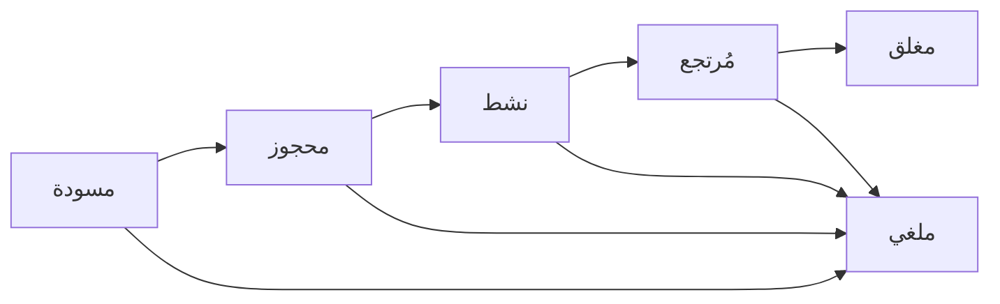
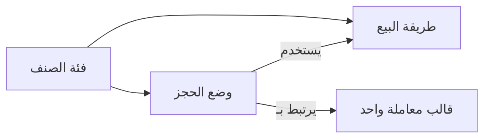
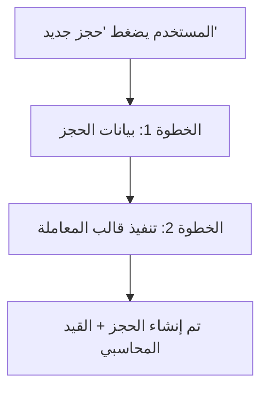

# تقرير: إعادة تصميم نظام الحجوزات

> التاريخ: 2026-02-28

---

## ما هو نظام الحجوزات؟

نظام الحجوزات يتيح حجز الأصناف (مثل: معدات، قاعات، سيارات) لفترة زمنية محددة مع تتبع دورة حياة الحجز من البداية إلى النهاية.

---

## حالات الحجز (State Machine)

| الحالة | المعنى |
|--------|--------|
| مسودة (Draft) | حجز تم إنشاؤه ولم يُؤكد بعد |
| محجوز (Reserved) | تم تأكيد الحجز — الصنف محجوز للعميل |
| نشط (Active) | العميل استلم الصنف |
| مُرتجع (Returned) | العميل أرجع الصنف |
| مغلق (Closed) | تمت التسوية المالية وانتهى الحجز |
| ملغي (Cancelled) | تم إلغاء الحجز من أي حالة |

---

## العلاقة مع طريقة البيع (Selling Mode) وقالب المعاملة (Transaction Template)

### ما هي طريقة البيع (Selling Mode)؟

طريقة البيع موجودة على مستوى **الصنف** وتحدد:
- وحدة البيع (مثل: علبة، كيلو، متر)
- معادلة التحويل (مثل: qty * L * W)
- تعريفات المدخلات (أبعاد، خيارات، متغيرات)

**مثال:** صنف "حديد" له طريقة بيع "بالطن" وطريقة بيع أخرى "بالقطعة"

### ما هو قالب المعاملة (Transaction Template)؟

قالب المعاملة هو النموذج المحاسبي الذي يُنفذ لإنشاء قيد يومية. يحتوي على:
- **حقول الإدخال** (input_fields): المبلغ، العربون، ملاحظات...
- **سطور القيد** (lines): الحسابات المدينة والدائنة
- **اختيار العميل**: يُحدد داخل القالب عند التنفيذ
- **اختيار العملة**: يُحدد داخل القالب عند التنفيذ
- **اختيار الأصناف**: يُحدد داخل القالب عند التنفيذ

### كيف ترتبط ببعضها؟

كل **فئة صنف** (Item Template) يمكن أن يكون لها طرق بيع وأوضاع حجز:

| العنصر | ينتمي إلى | الوظيفة | مثال |
|--------|-----------|---------|------|
| **فئة الصنف** (Item Template) | — | تعريف الصنف الأساسي | "معدات حفر" |
| **طريقة البيع** (Selling Mode) | فئة الصنف | وحدة البيع + المعادلة + المدخلات | "بالقطعة"، "بالطن" |
| **وضع الحجز** (Reservation Mode) | فئة الصنف | إعدادات الحجز + ربط المحاسبة | "إيجار أسبوعي" |
| **قالب المعاملة** (Transaction Template) | مستقل | النموذج المحاسبي (قيد يومية) | "قيد إيجار معدات" |

**العلاقات:**

> **وضع الحجز** هو حلقة الوصل — يربط **طريقة البيع** (كيف يُباع الصنف) مع **قالب المعاملة** (القيد المحاسبي الذي يُنفذ عند الحجز)

---

## التصميم الجديد المقترح

### المبدأ الأساسي

> **الحجز = جدولة زمنية** | **المعاملة = المحاسبة**

الحجز يهتم بـ:
- **متى؟** (تاريخ البداية والنهاية)
- **ماذا؟** (أي أصناف — لفحص التعارضات)
- **الحالة** (مسودة، محجوز، نشط...)

المعاملة تهتم بـ:
- **من؟** (العميل)
- **كم؟** (المبلغ، العربون)
- **بأي عملة؟**
- **القيد المحاسبي** (مدين/دائن)

### لماذا هذا الفصل مهم؟

| بدون الفصل (التصميم القديم) | مع الفصل (التصميم الجديد) |
|---|---|
| العميل يُختار في نموذج الحجز **ومرة ثانية** في المعاملة | العميل يُختار مرة واحدة في المعاملة فقط |
| العملة تُحدد في الحجز **ومرة ثانية** في المعاملة | العملة تُحدد مرة واحدة في المعاملة فقط |
| الأصناف تُختار في الحجز **ومرة ثانية** في المعاملة | الأصناف تُختار مرة واحدة |
| 5 قوالب معاملة لكل وضع حجز (واحد لكل تغيير حالة) | قالب معاملة واحد لكل وضع حجز |

### الفرق عن الشيكات

| | الشيكات | الحجوزات |
|---|---|---|
| **الإصدار** | قيد محاسبي (مدين تسوية، دائن بنك) | ❌ لا يوجد قيد |
| **التحصيل** | قيد محاسبي (مدين بنك، دائن تسوية) | ❌ لا يوجد قيد |
| **الارتجاع** | قيد عكسي | ❌ لا يوجد قيد |
| **عدد القوالب** | 3-5 قوالب (كل حالة = حدث مالي) | **قالب واحد فقط** |

في الشيكات، كل تغيير حالة **هو حدث مالي بحد ذاته**. أما في الحجوزات، الحالات هي **تتبع تشغيلي فقط** والحدث المالي واحد.

---

## سير العمل المقترح

### إنشاء حجز جديد (خطوتين)

**الخطوة 1 — نموذج الحجز (بسيط):**

| الحقل | مثال |
|-------|------|
| وضع الحجز | إيجار أسبوعي |
| من تاريخ | 2026-03-01 |
| إلى تاريخ | 2026-03-08 |
| ملاحظات | (اختياري) |

**الخطوة 2 — نافذة تنفيذ قالب المعاملة (الموجودة حالياً في النظام):**

| الحقل | مثال | ملاحظة |
|-------|------|--------|
| العميل | أحمد محمد | اختيار من الحسابات |
| العملة | دولار أمريكي | اختيار العملة |
| الأصناف | معدة حفر (2) + مولد كهربائي (1) | اختيار الأصناف والكميات |
| المبلغ | 1,200.00 | حسب الأصناف |
| العربون | 300.00 | (اختياري) |

> بعد الضغط على **"تنفيذ"** — يُنشأ الحجز والقيد المحاسبي معاً

### إدارة الحجز بعد الإنشاء

**صفحة تفاصيل الحجز تعرض:**

| البيان | القيمة |
|--------|--------|
| رقم الحجز | R-0001 |
| الحالة | محجوز |
| من تاريخ | 2026-03-01 |
| إلى تاريخ | 2026-03-08 |
| وضع الحجز | إيجار أسبوعي |
| الأصناف | معدة حفر (2)، مولد كهربائي (1) |
| المعاملة المرتبطة | TXN-0045 (رابط للعرض) |

**الأزرار المتاحة:** تفعيل | إرجاع | إغلاق | إلغاء

> هذه الأزرار تغير **الحالة فقط** — بدون أي قيد محاسبي جديد

---

## فحص التعارضات (Conflict Detection)

قبل إنشاء الحجز، النظام يفحص تلقائياً:
- هل الصنف محجوز في نفس الفترة الزمنية؟
- هل الكمية المتاحة كافية؟
- هل هناك تداخل مع فترة الحماية (buffer hours)؟

**مثال: معدة حفر (إجمالي المخزون: 5 وحدات)**

| الحجز | الكمية | الفترة |
|-------|--------|--------|
| حجز #1 | 3 وحدات | 1 مارس - 5 مارس |
| حجز #2 | 1 وحدة | 3 مارس - 7 مارس |
| **طلب جديد** | **2 وحدة** | **4 مارس - 6 مارس** |

**الحساب في فترة 4-5 مارس (أسوأ تداخل):**
- المحجوز: 3 + 1 = **4 وحدات**
- المتاح: 5 - 4 = **1 وحدة فقط**
- المطلوب: **2 وحدة**
- النتيجة: **تعارض!** الكمية المطلوبة أكبر من المتاح

---

## ملخص التغييرات

| العنصر | التصميم القديم | التصميم الجديد |
|--------|---------------|---------------|
| العميل | في نموذج الحجز | في قالب المعاملة فقط |
| العملة | في نموذج الحجز | في قالب المعاملة فقط |
| العربون | في نموذج الحجز | في قالب المعاملة فقط |
| الأصناف | في الحجز + المعاملة (مكرر) | مرة واحدة — تُنسخ للحجز تلقائياً |
| نوع التسعير | في وضع الحجز (مكرر) | يُستخدم من طريقة البيع مباشرة |
| قوالب المعاملات | 5 قوالب (واحد لكل حالة) | **قالب واحد فقط** |
| تغيير الحالة | قد يُنفذ قالب معاملة | تغيير حالة فقط — بدون محاسبة |

---

## سؤال مفتوح للنقاش

**هل نحتاج معاملة إضافية في حالات خاصة؟**

مثال: العميل أرجع المعدة وهي متضررة — هل نحتاج قيد "رسوم أضرار"؟

الخيارات:
1. **لا** — يتم ذلك يدوياً بقالب معاملة منفصل (خارج نظام الحجوزات)
2. **نعم** — نضيف إمكانية ربط معاملات إضافية بالحجز لاحقاً

---

> هذا التصميم يجعل نظام الحجوزات **أبسط وأوضح**: الحجز للجدولة، المعاملة للمحاسبة.
